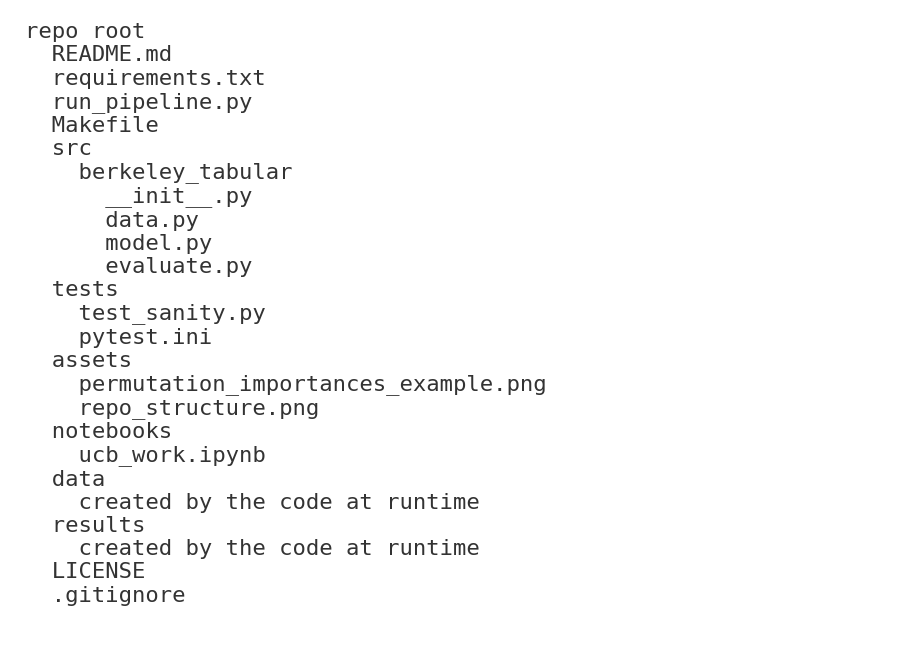
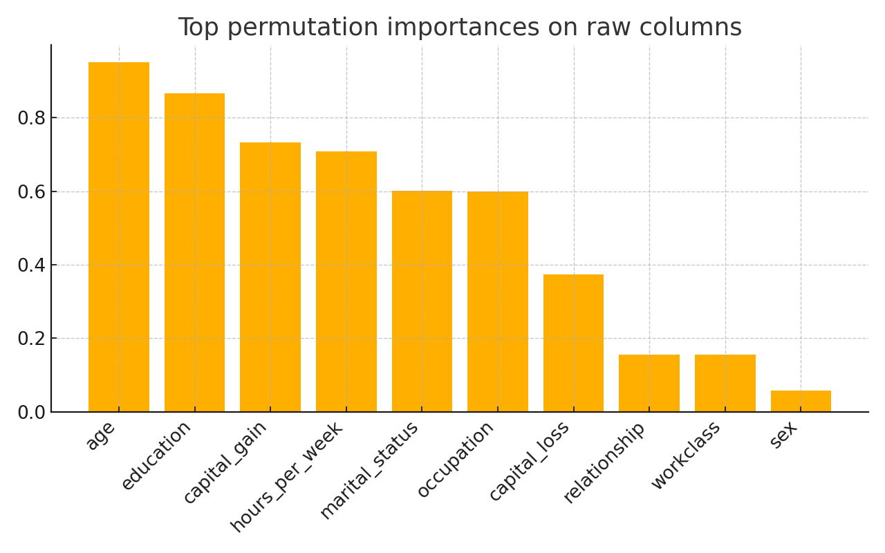

Berkeley tabular modeling project
Personal work that applies leakage safe modeling and honest validation

Project goal
I built a compact pipeline that classifies income on the Adult dataset while keeping data handling strictly leakage safe. The focus is on clean engineering and trustworthy metrics that a quant research team can audit.

Why this matters for a quant setting
1 I evaluate only out of fold predictions then pick a decision threshold using F1 on those same held out scores
2 I include a label shuffle control to show the pipeline does not learn spurious noise
3 I report permutation importances on raw columns for interpretability without peeking
4 The implementation is small and easy to read which helps review and reuse

Quick start
1 make setup
2 make run
3 open the results folder to review the artifacts

Expected outputs
1 metrics.json with out of fold AUC and F1 at the chosen threshold
2 per_fold.csv with fold level AUC accuracy and F1
3 importances.csv with permutation importances for raw columns
4 top_importances.png with the bar chart shown below

Technical choices
1 Data loading comes from OpenML on first run and is cached to data or you can drop adult.csv into that folder
2 All preprocessing is inside a scikit learn pipeline to keep fitting scoped to folds
3 Cross validation uses stratified folds and the grid is deliberately small so runs are fast and reproducible
4 I keep plotting and reporting minimal so the artifacts are easy to skim in a code review

Notebook provenance
The notebooks folder contains my original notebook as a provenance artifact from UC Berkeley work. The code in src is the curated version I now maintain as a personal project.

How to run tests
1 make test

Contact
If you want to discuss the modeling choices or how I would adapt this structure to alpha research send a note.
